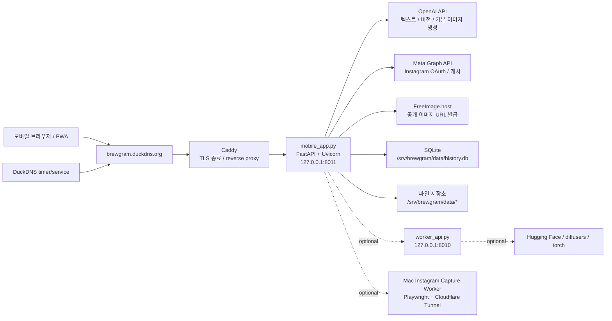

# Brewgram 인프라 스택 정리

이 문서는 **현재 최신 운영 흐름**을 기준으로, 인프라 관점에서 실제로 쓰이는 기술 스택을 공부 목적으로 정리한 자료다.

- 기준 운영 방식: **VM에서 `mobile_app.py` 실행**
- 공개 진입점: `https://brewgram.duckdns.org`
- 기본 이미지 생성 경로: `IMAGE_BACKEND_KIND=openai_image`
- 선택 경로: `remote_worker`, Mac 캡처 워커, 로컬 diffusers 워커

## 1. 한눈에 보는 현재 운영 구조

## 2. 스택을 읽는 기준

이 프로젝트의 인프라 스택은 크게 4층으로 나뉜다.

1. **VM 기본 운영층**: Linux VM, systemd, Caddy, DuckDNS
2. **애플리케이션 실행층**: Python, uv, FastAPI, Uvicorn
3. **데이터/파일 층**: SQLite, SQLAlchemy, 로컬 파일 저장소
4. **외부 연동층**: OpenAI, Meta Graph API, FreeImage, Langfuse, 선택형 Hugging Face/Cloudflare Tunnel

## 3. 필수 운영 스택

아래는 **현재 기본 운영에서 실제로 필요한 스택**이다.

| 분류 | 기술 | 현재 역할 | 왜 쓰는가 | 어디서 확인하나 |
| --- | --- | --- | --- | --- |
| 서버/OS | Linux VM | 단일 운영 서버 | 앱, reverse proxy, systemd 서비스, 로컬 DB를 한 곳에서 운영 | [infra/README.md](/Users/apple/Gen_for_SmallBusiness/infra/README.md) |
| DNS | DuckDNS | VM 공인 IP와 도메인 연결 | 고정 IP가 아니어도 도메인 유지 가능 | [infra/systemd/duckdns-refresh.service](/Users/apple/Gen_for_SmallBusiness/infra/systemd/duckdns-refresh.service), [infra/systemd/duckdns-refresh.timer](/Users/apple/Gen_for_SmallBusiness/infra/systemd/duckdns-refresh.timer), [infra/scripts/update_duckdns.sh](/Users/apple/Gen_for_SmallBusiness/infra/scripts/update_duckdns.sh) |
| 웹 서버 | Caddy | `80/443` 수신, HTTPS 종료, `mobile_app.py`로 reverse proxy | TLS 자동화와 설정 단순성이 좋음 | [infra/caddy/Caddyfile](/Users/apple/Gen_for_SmallBusiness/infra/caddy/Caddyfile) |
| 프로세스 관리 | systemd | `brewgram-mobile.service`, `brewgram-worker.service`, DuckDNS timer 실행 | 프로세스 재시작, 부팅 시 자동 실행, 로그 관리 | [infra/systemd/brewgram-mobile.service](/Users/apple/Gen_for_SmallBusiness/infra/systemd/brewgram-mobile.service), [infra/systemd/brewgram-worker.service](/Users/apple/Gen_for_SmallBusiness/infra/systemd/brewgram-worker.service) |
| 언어 런타임 | Python 3.11 | 서버 앱과 워커 실행 | FastAPI, OpenAI, SQLAlchemy, diffusers 생태계 사용 | [pyproject.toml](/Users/apple/Gen_for_SmallBusiness/pyproject.toml) |
| 패키지/실행 도구 | uv | 의존성 설치와 앱 실행 | 가볍고 빠른 Python 패키지/런타임 도구 | [infra/systemd/brewgram-mobile.service](/Users/apple/Gen_for_SmallBusiness/infra/systemd/brewgram-mobile.service), [infra/scripts/deploy_brewgram.sh](/Users/apple/Gen_for_SmallBusiness/infra/scripts/deploy_brewgram.sh) |
| 웹 프레임워크 | FastAPI | `mobile_app.py`, `worker_api.py`, 선택형 캡처 워커 API 제공 | HTTP API 작성이 단순하고 async 지원이 좋음 | [mobile_app.py](/Users/apple/Gen_for_SmallBusiness/mobile_app.py), [worker_api.py](/Users/apple/Gen_for_SmallBusiness/worker_api.py), [scripts/instagram_capture_worker.py](/Users/apple/Gen_for_SmallBusiness/scripts/instagram_capture_worker.py) |
| ASGI 서버 | Uvicorn | FastAPI 앱 실제 서빙 | Python async 웹 앱 표준 실행기 | [infra/systemd/brewgram-mobile.service](/Users/apple/Gen_for_SmallBusiness/infra/systemd/brewgram-mobile.service), [infra/systemd/brewgram-worker.service](/Users/apple/Gen_for_SmallBusiness/infra/systemd/brewgram-worker.service) |
| 데이터 저장 | SQLite | 운영 DB | 작은 단일 VM 구조에 맞고 운영이 단순함 | [config/runtime_paths.py](/Users/apple/Gen_for_SmallBusiness/config/runtime_paths.py), [README.md](/Users/apple/Gen_for_SmallBusiness/README.md) |
| ORM/DB 접근 | SQLAlchemy + aiosqlite | 비동기 DB 접근 | SQL 직접 문자열 관리보다 구조적이고 유지보수 쉬움 | [pyproject.toml](/Users/apple/Gen_for_SmallBusiness/pyproject.toml) |
| 파일 저장 | 로컬 파일시스템 (`APP_DATA_DIR`) | 온보딩 이미지, 상품 이미지, 생성 이미지, 브랜드 자산 저장 | DB에 바이너리를 다 넣지 않고 파일로 분리 | [config/runtime_paths.py](/Users/apple/Gen_for_SmallBusiness/config/runtime_paths.py) |
| 프론트 전달 | Stitch 정적 HTML/CSS/JS | 모바일 UI 제공 | 서버 템플릿 없이 정적 자산으로 빠르게 배포 가능 | [stitch/](/Users/apple/Gen_for_SmallBusiness/stitch) |
| PWA | Web App Manifest + Service Worker | 홈 화면 설치, 캐시, 모바일 앱처럼 보이는 경험 | 브라우저 기반 앱을 모바일 앱처럼 사용하게 함 | [stitch/manifest.webmanifest](/Users/apple/Gen_for_SmallBusiness/stitch/manifest.webmanifest), [stitch/service-worker.js](/Users/apple/Gen_for_SmallBusiness/stitch/service-worker.js) |

## 4. 현재 기본값인 AI / 외부 연동 스택

| 분류 | 기술 | 현재 역할 | 왜 쓰는가 | 어디서 확인하나 |
| --- | --- | --- | --- | --- |
| LLM / Vision | OpenAI API | 온보딩 분석, 광고 문구 생성, 참고 이미지 분석, 기본 이미지 생성 | 현재 운영의 핵심 AI 백엔드 | [config/settings.py](/Users/apple/Gen_for_SmallBusiness/config/settings.py), [services/onboarding_service.py](/Users/apple/Gen_for_SmallBusiness/services/onboarding_service.py), [services/text_service.py](/Users/apple/Gen_for_SmallBusiness/services/text_service.py), [backends/openai_image.py](/Users/apple/Gen_for_SmallBusiness/backends/openai_image.py) |
| 텍스트 모델 설정 | `TEXT_MODEL` | 텍스트 생성과 일부 비전 분석 모델 지정 | 운영 모델 교체를 env로 통제 | [config/settings.py](/Users/apple/Gen_for_SmallBusiness/config/settings.py) |
| 인스타 업로드 API | Meta Graph API | Instagram OAuth 연결, 게시 생성/발행 | 공식 API를 통한 업로드 | [services/instagram_service.py](/Users/apple/Gen_for_SmallBusiness/services/instagram_service.py), [services/instagram_auth_service.py](/Users/apple/Gen_for_SmallBusiness/services/instagram_auth_service.py) |
| 이미지 호스팅 | FreeImage.host | 인스타 게시 전 공개 이미지 URL 발급 | Meta 업로드 전에 공개 접근 가능한 URL이 필요함 | [services/instagram_service.py](/Users/apple/Gen_for_SmallBusiness/services/instagram_service.py) |
| HTTP 클라이언트 | httpx | OpenAI, Meta, FreeImage, 내부 워커 호출 | Python 서버 내부의 표준 HTTP 호출 도구 | [pyproject.toml](/Users/apple/Gen_for_SmallBusiness/pyproject.toml), [services/instagram_service.py](/Users/apple/Gen_for_SmallBusiness/services/instagram_service.py) |
| 토큰 암호화 | cryptography / Fernet | OAuth access token 암호화 저장 | DB에 평문 토큰 저장 방지 | [config/settings.py](/Users/apple/Gen_for_SmallBusiness/config/settings.py), [services/instagram_auth_service.py](/Users/apple/Gen_for_SmallBusiness/services/instagram_auth_service.py) |
| 관측성 | Langfuse | 요청/분석/generation trace | 어떤 사용자 흐름에서 어떤 AI 호출이 일어났는지 추적 | [config/settings.py](/Users/apple/Gen_for_SmallBusiness/config/settings.py), [README.md](/Users/apple/Gen_for_SmallBusiness/README.md) |

## 5. 선택형 스택

아래는 **현재 기본 운영에 항상 필요한 것은 아니지만**, 특정 상황에서 붙는 스택이다.

### 5.1 원격 이미지 워커 스택

기본 운영은 `openai_image`지만, 필요하면 앱 서버와 이미지 워커를 분리할 수 있다.

| 기술 | 역할 | 언제 쓰나 | 어디서 확인하나 |
| --- | --- | --- | --- |
| `worker_api.py` | 별도 FastAPI 이미지 워커 | `IMAGE_BACKEND_KIND=remote_worker`일 때 | [worker_api.py](/Users/apple/Gen_for_SmallBusiness/worker_api.py) |
| `IMAGE_WORKER_URL` / `IMAGE_WORKER_TOKEN` | 모바일 앱 -> 워커 호출 설정 | 워커 분리 운영 시 | [config/settings.py](/Users/apple/Gen_for_SmallBusiness/config/settings.py), [infra/env/mobile_app.vm.env.example](/Users/apple/Gen_for_SmallBusiness/infra/env/mobile_app.vm.env.example) |
| systemd worker service | 워커 프로세스 상시 실행 | VM 내부 워커 사용 시 | [infra/systemd/brewgram-worker.service](/Users/apple/Gen_for_SmallBusiness/infra/systemd/brewgram-worker.service) |

### 5.2 Hugging Face / diffusers 로컬 생성 스택

이미지 생성을 OpenAI가 아니라 VM 또는 개발자 머신의 모델로 돌릴 때 쓰는 스택이다.

| 기술 | 역할 | 언제 쓰나 | 어디서 확인하나 |
| --- | --- | --- | --- |
| PyTorch | 로컬 추론 엔진 기반 | `hf_local` 모드 | [pyproject.toml](/Users/apple/Gen_for_SmallBusiness/pyproject.toml) |
| diffusers | Stable Diffusion 파이프라인 | `hf_local` 모드 | [pyproject.toml](/Users/apple/Gen_for_SmallBusiness/pyproject.toml), [backends/hf_sd15.py](/Users/apple/Gen_for_SmallBusiness/backends/hf_sd15.py) |
| transformers | 일부 모델/processor 의존 | `hf_local`, `hf_remote_api` 주변 | [pyproject.toml](/Users/apple/Gen_for_SmallBusiness/pyproject.toml) |
| accelerate | diffusers 성능/메모리 실행 보조 | `hf_local` 모드 | [pyproject.toml](/Users/apple/Gen_for_SmallBusiness/pyproject.toml) |
| torchvision | 이미지 처리 보조 | `hf_local` 모드 | [pyproject.toml](/Users/apple/Gen_for_SmallBusiness/pyproject.toml) |
| Hugging Face Inference API | 서버리스 이미지 추론 대안 | `hf_remote_api` 모드 | [backends/hf_inference_api.py](/Users/apple/Gen_for_SmallBusiness/backends/hf_inference_api.py) |

### 5.3 Mac Instagram 캡처 워커

VM IP에서 Instagram 429가 날 때 쓰는 **데모용 우회 스택**이다. 기본 운영 필수는 아니다.

| 기술 | 역할 | 왜 필요하나 | 어디서 확인하나 |
| --- | --- | --- | --- |
| Playwright | 로그인된 브라우저 프로필로 Instagram 캡처 | VM IP 차단/429 회피 | [scripts/instagram_capture_worker.py](/Users/apple/Gen_for_SmallBusiness/scripts/instagram_capture_worker.py) |
| Chromium | Playwright 브라우저 엔진 | 실제 화면 캡처 | [infra/scripts/deploy_brewgram.sh](/Users/apple/Gen_for_SmallBusiness/infra/scripts/deploy_brewgram.sh) |
| Cloudflare Tunnel | Mac 로컬 워커를 VM에서 호출 가능하게 노출 | 공인 IP 없이 내부 도구 연결 | [README.md](/Users/apple/Gen_for_SmallBusiness/README.md), [docs/BREWGRAM_WORKER.md](/Users/apple/Gen_for_SmallBusiness/docs/BREWGRAM_WORKER.md) |

## 6. 현재 운영에서 중요한 설정 파일

### 6.1 앱 설정

- 모바일 앱 env: `/etc/brewgram/mobile_app.env`
- 워커 env: `/etc/brewgram/worker_api.env`
- DuckDNS env: `/etc/brewgram/duckdns.env`

예제 파일:

- [infra/env/mobile_app.vm.env.example](/Users/apple/Gen_for_SmallBusiness/infra/env/mobile_app.vm.env.example)
- [infra/env/worker_api.vm.env.example](/Users/apple/Gen_for_SmallBusiness/infra/env/worker_api.vm.env.example)
- [infra/env/duckdns.env.example](/Users/apple/Gen_for_SmallBusiness/infra/env/duckdns.env.example)

### 6.2 앱 코드 진입점

- 모바일 앱: [mobile_app.py](/Users/apple/Gen_for_SmallBusiness/mobile_app.py)
- 이미지 워커: [worker_api.py](/Users/apple/Gen_for_SmallBusiness/worker_api.py)
- 선택형 캡처 워커: [scripts/instagram_capture_worker.py](/Users/apple/Gen_for_SmallBusiness/scripts/instagram_capture_worker.py)

### 6.3 인프라 설정

- Caddy: [infra/caddy/Caddyfile](/Users/apple/Gen_for_SmallBusiness/infra/caddy/Caddyfile)
- systemd mobile: [infra/systemd/brewgram-mobile.service](/Users/apple/Gen_for_SmallBusiness/infra/systemd/brewgram-mobile.service)
- systemd worker: [infra/systemd/brewgram-worker.service](/Users/apple/Gen_for_SmallBusiness/infra/systemd/brewgram-worker.service)
- DuckDNS service/timer: [infra/systemd/duckdns-refresh.service](/Users/apple/Gen_for_SmallBusiness/infra/systemd/duckdns-refresh.service), [infra/systemd/duckdns-refresh.timer](/Users/apple/Gen_for_SmallBusiness/infra/systemd/duckdns-refresh.timer)
- 배포 스크립트: [infra/scripts/deploy_brewgram.sh](/Users/apple/Gen_for_SmallBusiness/infra/scripts/deploy_brewgram.sh)

## 7. 포트, 경로, 자산 맵

| 항목 | 값 | 의미 |
| --- | --- | --- |
| 공개 도메인 | `https://brewgram.duckdns.org` | 사용자 진입점 |
| Caddy | `:80`, `:443` | HTTP/HTTPS 수신 |
| mobile_app | `127.0.0.1:8011` | 현재 기본 운영 앱 |
| worker_api | `127.0.0.1:8010` | 선택형 이미지 워커 |
| capture worker | `127.0.0.1:8020` | 선택형 Mac 내부 캡처 워커 |
| 앱 데이터 루트 | `/srv/brewgram/data` | DB와 파일 자산 저장 루트 |
| SQLite DB | `/srv/brewgram/data/history.db` | 운영 데이터베이스 |

## 8. 현재 운영 흐름에서 특히 알아둘 점

### 8.1 기본 이미지 생성은 OpenAI 직접 호출이다

현재 기본값은 `IMAGE_BACKEND_KIND=openai_image`다. 즉:

- `mobile_app.py`가 직접 OpenAI 이미지 API를 호출한다.
- `worker_api.py`는 기본 운영 필수가 아니다.
- 문구 생성, 참고 이미지 분석, 이미지 생성이 모두 OpenAI 축에 많이 묶여 있다.

관련 설정:

- [config/settings.py](/Users/apple/Gen_for_SmallBusiness/config/settings.py)
- [README.md](/Users/apple/Gen_for_SmallBusiness/README.md)

### 8.2 PWA 캐시도 인프라 이슈다

이 프로젝트는 모바일 웹이 아니라 **PWA 운영**에 가깝다. 그래서 아래도 인프라 관점에서 중요하다.

- `manifest.webmanifest`
- `service-worker.js`
- Caddy의 `Cache-Control: no-cache`

즉, 프론트 코드만 고쳐도 reverse proxy 캐시 정책과 service worker 갱신 여부를 같이 봐야 한다.

### 8.3 DB와 파일 저장소는 repo 밖으로 분리된다

운영에서는 `APP_DATA_DIR=/srv/brewgram/data`를 쓰는 것이 핵심이다.

- 코드 배포와 데이터 보존을 분리할 수 있다.
- `git pull`이나 재배포를 해도 DB와 생성 이미지가 살아남는다.
- env가 빠지면 repo 내부 `data/`를 다시 써버릴 수 있으니 주의해야 한다.

관련 파일:

- [config/runtime_paths.py](/Users/apple/Gen_for_SmallBusiness/config/runtime_paths.py)
- [infra/README.md](/Users/apple/Gen_for_SmallBusiness/infra/README.md)

### 8.4 배포 자동화는 Bash + git + systemd 조합이다

현재 배포 자동화는 Kubernetes나 Docker 기반이 아니다. 대신:

- `git fetch/pull`
- `uv sync`
- `playwright install chromium`
- `systemctl restart`

조합으로 운영한다.

즉, 공부 순서도 컨테이너 오케스트레이션보다 **Linux 서비스 운영**을 먼저 보는 편이 맞다.

주의:

- 현재 운영 문서는 `main` 배포 기준으로 정리돼 있다.
- 다만 배포 스크립트 [infra/scripts/deploy_brewgram.sh](/Users/apple/Gen_for_SmallBusiness/infra/scripts/deploy_brewgram.sh) 의 기본 `BREWGRAM_DEPLOY_BRANCH` 값은 아직 `merge/dev`로 남아 있다.
- 스크립트를 그대로 쓰면 env override 없이 문서 기준과 다르게 동작할 수 있으니 확인이 필요하다.

## 9. 공부 우선순위 추천

인프라를 공부한다면 아래 순서가 효율적이다.

1. **Linux VM + systemd**
   - 서비스가 어떻게 뜨고 재시작되는지
   - env 파일을 어떻게 주입하는지
2. **Caddy**
   - reverse proxy
   - TLS 자동 관리
   - 정적 자산 캐시 헤더
3. **FastAPI + Uvicorn**
   - Python 서버 앱이 어떻게 포트를 열고 요청을 받는지
4. **SQLite + 파일 저장소**
   - 단일 VM 구조에서 왜 이 조합이 단순한지
5. **OpenAI / Meta / FreeImage 같은 외부 API 연동**
   - 서버가 외부 SaaS를 호출해 비즈니스 기능을 완성하는 방식
6. **선택형 스택**
   - worker_api
   - Hugging Face local inference
   - Playwright + Cloudflare Tunnel

## 10. 기술별 공부 키워드

| 기술 | 공부 키워드 |
| --- | --- |
| Linux VM | system administration, process lifecycle, logs, permissions |
| systemd | unit file, restart policy, environment file, timer |
| Caddy | reverse proxy, automatic HTTPS, header policy |
| DuckDNS | DDNS, dynamic public IP, domain automation |
| Python | runtime, packaging, async I/O |
| uv | dependency sync, isolated run, Python tooling |
| FastAPI | routing, request/response model, dependency injection |
| Uvicorn | ASGI server, event loop, process serving |
| SQLite | embedded database, single-node persistence |
| SQLAlchemy | ORM, async session, model mapping |
| OpenAI API | text generation, vision, image generation |
| Meta Graph API | OAuth, media creation, publish flow |
| FreeImage.host | public asset hosting, media URL handoff |
| Langfuse | LLM observability, tracing, tagging |
| Playwright | browser automation, persistent profile |
| Cloudflare Tunnel | outbound tunnel, local service exposure |
| diffusers / torch | local model inference, GPU runtime |

## 11. 한 문장 요약

현재 Brewgram의 인프라 운영은 **“단일 Linux VM 위에서 Caddy + systemd + FastAPI/Uvicorn + SQLite/파일저장소를 기본으로 두고, OpenAI/Meta 같은 외부 API와 선택형 워커 스택을 붙여서 운영하는 구조”**라고 이해하면 된다.
