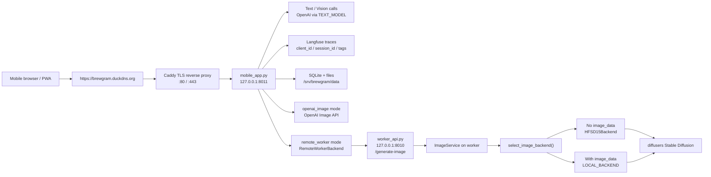
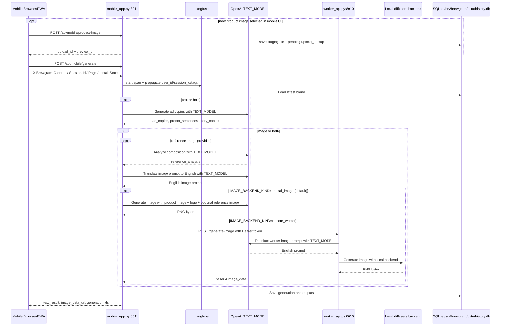
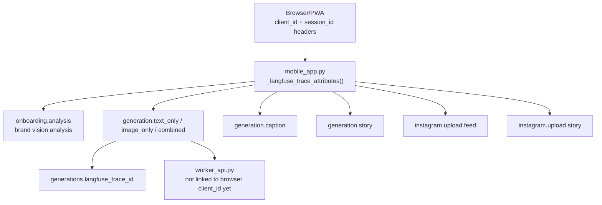
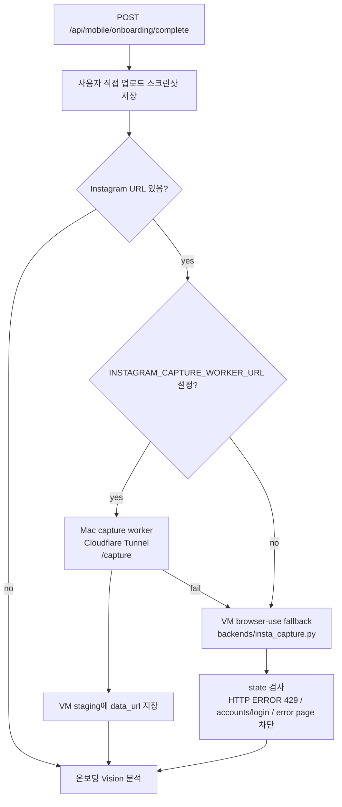

# Mobile App to VM Worker Workflow

이 문서는 모바일 PWA 기준으로 `mobile_app.py`의 생성, 업로드, Langfuse 추적 흐름을 정리한다.

2026-04-16 기준으로 이미지 생성 경로는 두 가지다.

- `IMAGE_BACKEND_KIND=openai_image`: `mobile_app.py`가 OpenAI 이미지 API를 직접 호출한다. 현재 VM 데모의 기본 경로이며 `worker_api.py`가 필요 없다.
- `IMAGE_BACKEND_KIND=remote_worker`: `mobile_app.py`가 VM 내부 `worker_api.py`를 호출한다. 로컬 diffusers/Hugging Face 워커를 쓸 때의 선택 경로다.

또한 Instagram 프로필 캡처는 VM IP 429를 피하기 위해 Mac 로컬 캡처 워커를 우선 사용할 수 있다. `INSTAGRAM_CAPTURE_WORKER_URL`이 설정되어 있으면 `mobile_app.py`가 Cloudflare Tunnel 뒤의 Mac 워커에 캡처를 요청하고, 실패하면 VM의 `backends/insta_capture.py` fallback을 시도한다.

운영 기준:

- 공개 진입점: `https://brewgram.duckdns.org`
- Reverse proxy: Caddy, `80/443`
- Mobile FastAPI: `mobile_app.py`, `127.0.0.1:8011`
- Image Worker FastAPI: `worker_api.py`, `127.0.0.1:8010` (`remote_worker` 모드에서만)
- 운영 데이터: `/srv/brewgram/data`
- DB: `/srv/brewgram/data/history.db`

## 1. Runtime Topology



핵심 분리:

- `mobile_app.py`는 외부 요청, 브랜드/생성/업로드 DB 저장, 텍스트 생성, 캡션 생성, 스토리 합성을 담당한다.
- `worker_api.py`는 `remote_worker` 모드에서만 이미지 생성 내부 API로 사용한다.
- 외부에서는 `worker_api.py`에 직접 접근하지 않는다. `IMAGE_WORKER_HOST=127.0.0.1`로 VM 내부에서만 받는 구조가 기준이다.
- `openai_image` 모드에서는 `mobile_app.py`가 직접 이미지 생성까지 처리한다.

## 2. LangGraph Style Generation Graph

`/api/mobile/generate` 요청 하나를 상태 그래프로 보면 다음과 같다.

```mermaid
flowchart TD
    Start(["START<br/>POST /api/mobile/generate"])
    Validate["validate payload<br/>product_name required"]
    LoadBrand["load latest Brand<br/>build brand_prompt"]
    DecodeProduct["decode product_image<br/>only required when is_new_product=true"]
    DecodeReference["decode optional reference_image"]
    PickImageInput["product image 선택<br/>new: uploaded image via /product-image<br/>existing: DB product image"]
    AnalyzeReference{"reference image exists?"}
    RefAnalysis["ReferenceAnalyzer<br/>composition-only analysis<br/>TEXT_MODEL"]
    NeedText{"generation_type<br/>text or both?"}
    TextNode["TextService.generate_ad_copy<br/>OpenAIGPTBackend<br/>TEXT_MODEL"]
    NeedImage{"generation_type<br/>image or both?"}
    MobileImage["Mobile ImageService.generate_ad_image<br/>build image prompt<br/>TEXT_MODEL"]
    BackendChoice{"IMAGE_BACKEND_KIND<br/>default=openai_image"}
    OpenAIImageNode["OpenAIImageBackend<br/>gpt-image multi-input"]
    RemoteCall["RemoteWorkerBackend<br/>POST /generate-image<br/>Bearer IMAGE_WORKER_TOKEN"]
    WorkerDecode["worker_api decodes base64<br/>build ImageGenerationRequest"]
    WorkerImage["Worker ImageService.generate_ad_image<br/>select local backend<br/>generate image"]
    Save["GenerationService.create_with_outputs<br/>save image/text outputs<br/>save product raw image if new product"]
    Response(["END<br/>MobileGenerateResponse"])

    Start --> Validate --> LoadBrand --> DecodeProduct --> DecodeReference --> PickImageInput --> AnalyzeReference
    AnalyzeReference -- yes --> RefAnalysis --> NeedText
    AnalyzeReference -- no --> NeedText
    NeedText -- yes --> TextNode --> NeedImage
    NeedText -- no --> NeedImage
    NeedImage -- yes --> MobileImage --> BackendChoice
    BackendChoice -- openai_image --> OpenAIImageNode --> Save
    BackendChoice -- remote_worker --> RemoteCall --> WorkerDecode --> WorkerImage --> Save
    NeedImage -- no --> Save
    Save --> Response
```



상태 필드 관점:

```text
GenerationState
  payload
  brand
  brand_prompt
  product_image_bytes
  existing_product_name
  reference_bytes
  image_input_bytes
  reference_analysis
  text_result
  image_result
  langfuse_trace_id
  generation_id
  generation_output_id
```

현재 브랜치의 이미지 입력 규칙:

- `is_new_product=true`: 생성 화면에서 카메라 촬영 또는 앨범 선택 후 `POST /api/mobile/product-image`로 먼저 업로드한다. 이후 `/api/mobile/generate`에는 `product_image_upload_id`를 우선 전달하고, 필요할 때만 inline `product_image`를 fallback으로 쓴다.
- `is_new_product=false`: UI에서 `/api/mobile/products`로 기존 상품 목록을 불러오고, 사용자가 고른 `existing_product_name`으로 DB에 저장된 최근 상품 raw 이미지를 다시 읽어 이미지 생성에 사용한다.
- 별도 `reference_image`가 있으면, 이미지는 구도 분석용 `reference_analysis`로 들어간다. 브랜드 톤/색감이 아니라 구도만 참고시키는 것이 목적이다.
- 텍스트 생성에는 `reference_bytes`가 있으면 이미지 힌트로 전달되지만, 실제 문구는 상품명/설명/브랜드 가이드 중심으로 생성된다.
- 현재 `openai_image` 기본 경로에서는 브랜드의 `logo_path`가 항상 이미지 생성 입력에 포함된다. 새 로고가 없으면 기존 로고를 재사용하고, 기존 로고도 없으면 온보딩에서 워드마크 PNG를 자동 생성해 넣는다.

## 3. Sequence Diagram



주의: 현 코드 기준으로 `mobile_app.py`와 `worker_api.py` 양쪽 모두 `ImageService.generate_ad_image()`를 사용한다. `mobile_app.py`는 `remote_worker` 호출 전에 프롬프트를 한 번 영문화하고, `worker_api.py`는 `hf_local` 백엔드 호출 전에 다시 영문화한다. 즉, 현재 구조에서는 이미지 생성 경로에서 OpenAI 프롬프트 번역이 2회 발생할 수 있다. 추후 중복을 줄이려면 `worker_api.py`가 `ImageService`가 아니라 로컬 이미지 백엔드를 직접 호출하거나, `ImageGenerationRequest`에 "이미 번역됨" 플래그를 추가하는 방식이 필요하다.

## 4. Langfuse Tracing and Client Identity

현재 모바일 PWA는 로그인 사용자 ID가 없기 때문에, 브라우저별 익명 `client_id`를 Langfuse의 `user_id`처럼 사용한다. 목적은 "누가"의 실명 식별이 아니라, 같은 브라우저/기기에서 이어진 생성·캡션·업로드 흐름을 한 사용 흐름으로 묶어 보는 것이다.

### 4.1 Client ID 생성 시점

`stitch/shared.js`의 모든 `api()` 호출은 요청 직전에 `buildTraceHeaders()`를 실행한다.

전송되는 헤더:

```http
X-Brewgram-Client-Id: <browser-persistent random uuid>
X-Brewgram-Session-Id: <tab/session random uuid>
X-Brewgram-Page: <current stitch page>
X-Brewgram-Install-State: installed | available | ios_manual | manual | unsupported
```

ID 저장 방식:

| 값 | 저장 위치 | 유지 범위 | 용도 |
|---|---|---|---|
| `client_id` | `localStorage["brewgram.mobile.client-id.v1"]` | 같은 브라우저 프로필/도메인에서 유지. 브라우저 데이터 삭제 시 재발급 | Langfuse `user_id` |
| `session_id` | `sessionStorage["brewgram.mobile.session-id.v1"]` | 보통 탭/브라우징 세션 단위. 탭 종료 시 재발급 | Langfuse `session_id` |
| `page` | `document.body.dataset.stitchPage` | 요청 시점의 현재 화면 | Langfuse tag/metadata |
| `install_state` | PWA display mode와 브라우저 상태로 계산 | 요청 시점의 설치 상태 | Langfuse tag/metadata |

즉 같은 iPhone Safari에서 같은 도메인으로 계속 사용하면 보통 같은 `client_id`로 묶인다. 다만 Safari 데이터 삭제, private browsing, 도메인 변경, 브라우저 변경, localStorage 차단이 있으면 새 `client_id`가 발급될 수 있다.

### 4.2 Server Mapping

`mobile_app.py`는 요청 헤더를 읽어 `_langfuse_trace_attributes()`에서 Langfuse 속성으로 전파한다.

```text
X-Brewgram-Client-Id      -> Langfuse user_id
X-Brewgram-Session-Id     -> Langfuse session_id
X-Brewgram-Page           -> tag: page:<page>, metadata.page
X-Brewgram-Install-State  -> tag: install:<state>, metadata.install_state
request.url.path          -> metadata.request_path
```

모든 모바일 trace에는 기본적으로 다음 값이 붙는다.

```text
tag: surface:mobile
metadata.surface = mobile
```

기능별 endpoint는 여기에 `feature:*`, `generation_type:*`, `upload:*` 같은 추가 tag와 요청 요약 metadata를 더 붙인다.

### 4.3 Traced Nodes



현재 코드에서 명시적으로 Langfuse span을 여는 구간:

| Trace name | Endpoint | 조건 | 주요 tag | 주요 metadata |
|---|---|---|---|---|
| `onboarding.analysis` | `POST /api/mobile/onboarding/complete` | 분석 이미지가 있고 `OPENAI_API_KEY`가 준비된 경우 | `surface:mobile`, `feature:onboarding`, `page:*`, `install:*` | `analysis_image_count`, `has_instagram_url`, `request_path` |
| `generation.text_only` | `POST /api/mobile/generate` | `generation_type=text` | `surface:mobile`, `feature:generation`, `generation_type:text`, `page:*`, `install:*` | `product_name_length`, `description_length`, `is_new_product`, `has_reference_image`, `has_product_image` |
| `generation.image_only` | `POST /api/mobile/generate` | `generation_type=image` | `surface:mobile`, `feature:generation`, `generation_type:image`, `page:*`, `install:*` | 위와 동일 |
| `generation.combined` | `POST /api/mobile/generate` | `generation_type=both` | `surface:mobile`, `feature:generation`, `generation_type:both`, `page:*`, `install:*` | 위와 동일 |
| `generation.caption` | `POST /api/mobile/caption` | 캡션 생성 요청 | `surface:mobile`, `feature:caption`, `page:*`, `install:*` | `is_new_product`, `ad_copy_count`, `product_name_length` |
| `generation.story` | `POST /api/mobile/story` | 스토리 이미지 합성 요청 | `surface:mobile`, `feature:story`, `page:*`, `install:*` | `text_length` |
| `instagram.upload.feed` | `POST /api/mobile/upload/feed` | 피드 업로드 요청 | `surface:mobile`, `feature:upload`, `upload:feed`, `page:*`, `install:*` | `has_caption` |
| `instagram.upload.story` | `POST /api/mobile/upload/story` | 스토리 업로드 요청 | `surface:mobile`, `feature:upload`, `upload:story`, `page:*`, `install:*` | `has_caption` |

`POST /api/mobile/generate`는 `_capture_langfuse_trace_id()`로 현재 trace id를 읽어 `generations.langfuse_trace_id`에 저장한다. 이 값으로 DB의 생성 레코드와 Langfuse trace를 나중에 연결해서 볼 수 있다.

### 4.4 What Langfuse Shows in This Workflow

Langfuse에서 확인할 수 있는 것:

- 같은 브라우저의 반복 사용 흐름: `user_id = client_id`
- 같은 탭/세션 안에서의 연속 행동: `session_id`
- 어느 PWA 화면에서 발생했는지: `page:*`, `metadata.page`
- 홈 화면 설치 상태에서 실행됐는지: `install:*`, `metadata.install_state`
- 온보딩 분석 이미지 수와 인스타 URL 사용 여부
- 생성 타입: `text`, `image`, `both`
- 신상품 여부, 상품명/설명 길이, 상품 이미지/참조 이미지 사용 여부
- 캡션/스토리/업로드까지 이어지는 후속 행동
- OpenAI wrapper를 통과한 텍스트 생성, Vision 분석, 프롬프트 번역 호출의 모델/토큰/latency

현재 명확히 추적되지 않는 것:

- 실명 사용자, 인스타 계정 주체, 로그인 계정 단위 식별. 현재는 익명 브라우저 ID 기준이다.
- `worker_api.py` 내부 로컬 diffusers 추론 시간과 모델 파라미터는 Langfuse trace에 직접 연결되어 있지 않다. systemd 로그와 worker `/health`로 확인한다.
- `mobile_app.py -> worker_api.py` HTTP 호출은 Langfuse trace context를 명시 전파하지 않는다. 따라서 worker 쪽 OpenAI 프롬프트 번역이 Langfuse에 잡히더라도, 현재 브라우저 `client_id/session_id`와 자동으로 같은 trace에 묶인다고 보장하면 안 된다.
- 정적 파일, `GET /api/mobile/bootstrap`, `GET /api/mobile/instagram/status`, root redirect 같은 단순 조회성 요청은 명시 Langfuse span을 열지 않는다.

### 4.5 Practical Queries

Langfuse에서 볼 때 유용한 필터:

| 보고 싶은 것 | 필터 기준 |
|---|---|
| 모바일 전체 사용량 | tag `surface:mobile` |
| 특정 브라우저/기기 흐름 | `user_id = <client_id>` |
| 한 세션의 연속 행동 | `session_id = <session_id>` |
| 생성 요청만 보기 | tag `feature:generation` |
| 이미지 생성만 보기 | tag `generation_type:image` 또는 trace name `generation.image_only` |
| 글+이미지 생성 보기 | tag `generation_type:both` 또는 trace name `generation.combined` |
| 신상품 생성만 보기 | metadata `is_new_product=true` |
| 홈화면 설치 사용 여부 보기 | tag `install:installed` |
| 특정 화면에서 발생한 요청 | tag `page:<stitch page>` |

운영에서 실제 사용자를 더 정확히 구분하려면, 인스타 OAuth 연결 후 `brand.instagram_account_id`나 내부 계정 ID를 Langfuse `user_id` 또는 metadata에 추가하는 설계를 별도로 넣어야 한다. 지금은 의도적으로 인증 전 단계에서도 동작하는 익명 기기 기반 추적이다.

## 5. Endpoint and Responsibility Map

| Endpoint | Process | Worker 사용 | 역할 |
|---|---|---:|---|
| `GET /health` | `mobile_app.py` | no | mobile 앱 상태와 `IMAGE_BACKEND_KIND` 확인 |
| `POST /api/mobile/onboarding/complete` | `mobile_app.py` | no | 브랜드 입력 저장, 이미지 분석, 브랜드 가이드 생성 또는 제한적 프로필 갱신 |
| `POST /api/mobile/product-image` | `mobile_app.py` | no | 신상품 촬영/앨범 이미지를 staging에 저장하고 `upload_id` + `preview_url` 반환 |
| `POST /api/mobile/generate` | `mobile_app.py` | only when `IMAGE_BACKEND_KIND=remote_worker` and image/both | 광고 문구와 이미지 생성, DB 저장 |
| `POST /generate-image` | `worker_api.py` | n/a | `remote_worker` 모드의 내부 이미지 생성 API. 현재 브라우저 `client_id`는 여기까지 전파되지 않음 |
| `POST /api/mobile/caption` | `mobile_app.py` | no | 생성된 광고 문구 기반 인스타 캡션 생성 |
| `POST /api/mobile/story` | `mobile_app.py` | no | 생성 이미지를 9:16 스토리 이미지로 합성 |
| `POST /api/mobile/upload/feed` | `mobile_app.py` | no | 인스타 피드 업로드 및 업로드 기록 저장 |
| `POST /api/mobile/upload/story` | `mobile_app.py` | no | 인스타 스토리 업로드 및 업로드 기록 저장 |

### 5.1 Mobile Create UI Notes

- 신상품 사진은 생성 화면에서 바로 `촬영` 또는 `앨범`을 고르는 구조다. 선택 직후 미리보기를 먼저 바꾸고, 백엔드가 반환한 `preview_url` / `upload_id`로 상태를 확정한다.
- `다시 만들기`는 별도 생성 파이프라인이 아니라 메인 생성 버튼과 같은 요청 경로를 다시 탄다. 현재 상세 옵션 상태를 다시 읽어 같은 `/api/mobile/generate`로 보낸다.
- 현재 생성 화면의 참고 구도 입력은 업로드 이미지 1장 기준이다. URL 입력 UI는 제공하지 않는다.
- 캡션 생성 후에는 사용자가 텍스트를 수정할 수 있다. 수정 내용은 `저장`을 눌렀을 때만 인스타 미리보기와 피드 업로드 payload에 반영된다.
- 저장 전에는 마지막 저장본이 유지된다. 따라서 "생성된 원본 캡션"과 "편집 중 draft"를 구분해 보는 것이 현재 UX 의도다.
- 현재 이미지 생성 파이프라인은 `brand.logo_path`를 전제로 움직인다. 로고를 새로 올리지 않으면 기존 로고를 쓰고, 기존 로고도 없으면 온보딩 시 자동 워드마크를 생성한다.

## 6. Instagram Capture Worker

온보딩의 Instagram URL 캡처는 아래 순서로 진행된다.



Mac 캡처 워커는 캡처 이미지를 로컬 파일로 저장하지 않고, PNG를 `data:image/png;base64,...` 형태로 VM에 반환한다. VM의 `mobile_app.py`가 이를 `/srv/brewgram/data/staging/` 아래에 저장한다.

관련 env:

```env
INSTAGRAM_CAPTURE_WORKER_URL=https://<cloudflare-tunnel>.trycloudflare.com
INSTAGRAM_CAPTURE_WORKER_TOKEN=...
INSTAGRAM_CAPTURE_WORKER_TIMEOUT=90.0
```

관련 Mac 실행:

```bash
CAPTURE_WORKER_TOKEN="<TOKEN>" \
CAPTURE_WORKER_HEADLESS=1 \
uv run uvicorn scripts.instagram_capture_worker:app --host 127.0.0.1 --port 8020
```

## 7. Default Models

### 7.1 Text, Vision, Prompt Translation

기본값:

```env
TEXT_MODEL=gpt-5-mini
TEXT_TIMEOUT=90.0
```

`TEXT_MODEL` 사용 위치:

- 광고 문구 생성: `services/text_service.py` -> `backends/openai_gpt.py`
- 캡션 생성: `services/caption_service.py`
- 온보딩 브랜드 분석: `services/onboarding_service.py`, `mobile_app.py`
- 참조 이미지 구도 분석: `services/reference_service.py`
- 이미지 프롬프트 한국어 -> 영어 번역: `services/image_service.py`

운영에서 현재 구조를 유지한다면 `TEXT_MODEL`은 두 env에 모두 넣는 편이 안전하다.

- `/etc/brewgram/mobile_app.env`: 텍스트 생성, 캡션, 온보딩/참조 분석, mobile 측 이미지 프롬프트 번역
- `/etc/brewgram/worker_api.env`: worker 측 이미지 프롬프트 번역

### 7.2 Mobile Image Backend

현재 VM 데모 기본값:

```env
IMAGE_BACKEND_KIND=openai_image
IMAGE_TIMEOUT=180.0
```

이 모드에서는 `mobile_app.py`가 직접 OpenAI 이미지 API를 호출한다. `worker_api.py`는 필요 없다.

`remote_worker` 운영값:

```env
IMAGE_BACKEND_KIND=remote_worker
IMAGE_WORKER_URL=http://127.0.0.1:8010
IMAGE_WORKER_TOKEN=...
IMAGE_WORKER_TIMEOUT=180.0
```

의미:

- `mobile_app.py`는 직접 diffusers 모델을 띄우지 않는다.
- `RemoteWorkerBackend`가 `IMAGE_WORKER_URL/generate-image`로 요청을 보낸다.
- `IMAGE_WORKER_TOKEN`은 mobile env와 worker env가 같아야 한다.

### 7.3 Worker Image Backend

`remote_worker` 모드일 때만 사용한다.

```env
IMAGE_BACKEND_KIND=hf_local
LOCAL_BACKEND=ip_adapter
LOCAL_SD15_MODEL_ID=runwayml/stable-diffusion-v1-5
LOCAL_MODEL_CACHE_DIR=./models/cache
LOCAL_IP_ADAPTER_ID=h94/IP-Adapter
LOCAL_IP_ADAPTER_SUBFOLDER=models
LOCAL_IP_ADAPTER_WEIGHT_NAME=ip-adapter_sd15.bin
LOCAL_INFERENCE_STEPS=18
LOCAL_GUIDANCE_SCALE=7.5
LOCAL_IP_ADAPTER_SCALE=0.6
LOCAL_IMG2IMG_STRENGTH=0.5
```

이미지 백엔드 선택 규칙:

| 조건 | 선택 백엔드 | 실제 모델/구성 |
|---|---|---|
| `IMAGE_BACKEND_KIND=mock` | `MockImageBackend` | Pillow gradient, 외부 호출 없음 |
| `IMAGE_BACKEND_KIND=hf_remote_api` | `HFInferenceAPIBackend` | `IMAGE_MODEL`로 Hugging Face Serverless API 호출 |
| `IMAGE_BACKEND_KIND=remote_worker` | `RemoteWorkerBackend` | 다른 `worker_api.py` 호출 |
| `IMAGE_BACKEND_KIND=hf_local`, `image_data 없음` | `HFSD15Backend` | `LOCAL_SD15_MODEL_ID` |
| `IMAGE_BACKEND_KIND=hf_local`, `image_data 있음`, `LOCAL_BACKEND=ip_adapter` | `HFIPAdapterBackend` | `LOCAL_SD15_MODEL_ID` + `LOCAL_IP_ADAPTER_ID` |
| `IMAGE_BACKEND_KIND=hf_local`, `image_data 있음`, `LOCAL_BACKEND=img2img` | `HFImg2ImgBackend` | `LOCAL_SD15_MODEL_ID` img2img |
| `IMAGE_BACKEND_KIND=hf_local`, `image_data 있음`, `LOCAL_BACKEND=hybrid` | `HFHybridBackend` | img2img + IP-Adapter |

주의:

- `worker_api.py`는 `IMAGE_BACKEND_KIND=remote_worker`로 실행할 수 없다. 코드에서 무한 루프 방지를 위해 즉시 에러를 낸다.
- `IMAGE_MODEL=stabilityai/stable-diffusion-xl-base-1.0` 기본값은 `hf_remote_api` 경로에서 쓰인다.
- `hf_local` 경로의 실제 기본 모델은 `LOCAL_SD15_MODEL_ID=runwayml/stable-diffusion-v1-5`다.

## 8. How to Change Models

### 8.1 광고 문구, 캡션, Vision, 프롬프트 번역 모델 변경

수정 파일:

```text
/etc/brewgram/mobile_app.env
/etc/brewgram/worker_api.env
```

예시:

```env
TEXT_MODEL=gpt-5-mini
TEXT_TIMEOUT=90.0
```

적용:

```bash
sudo systemctl restart brewgram-worker.service brewgram-mobile.service
```

확인:

```bash
sudo journalctl -u brewgram-mobile.service -n 80 --no-pager
sudo journalctl -u brewgram-worker.service -n 80 --no-pager
```

### 8.2 Worker의 로컬 이미지 모델 변경

수정 파일:

```text
/etc/brewgram/worker_api.env
```

예시:

```env
IMAGE_BACKEND_KIND=hf_local
LOCAL_SD15_MODEL_ID=runwayml/stable-diffusion-v1-5
LOCAL_MODEL_CACHE_DIR=/srv/brewgram/models/cache
```

적용:

```bash
sudo systemctl restart brewgram-worker.service
curl http://127.0.0.1:8010/health
```

첫 호출 때 모델이 다운로드될 수 있으므로 디스크와 시간이 필요하다.

### 8.3 참조 이미지 반영 방식 변경

수정 파일:

```text
/etc/brewgram/worker_api.env
```

옵션:

```env
LOCAL_BACKEND=ip_adapter
LOCAL_BACKEND=img2img
LOCAL_BACKEND=hybrid
```

권장 기준:

- `ip_adapter`: 상품 사진의 분위기/시각 특징을 반영하되, 텍스트 프롬프트 자유도가 비교적 높다.
- `img2img`: 원본 구조를 더 강하게 보존한다.
- `hybrid`: 구조 보존과 IP-Adapter 반영을 동시에 시도한다. 가장 무겁고 튜닝 여지가 많다.

튜닝 값:

```env
LOCAL_INFERENCE_STEPS=18
LOCAL_GUIDANCE_SCALE=7.5
LOCAL_IP_ADAPTER_SCALE=0.6
LOCAL_IMG2IMG_STRENGTH=0.5
```

해석:

- `LOCAL_INFERENCE_STEPS`: 높을수록 느리지만 품질이 안정될 수 있다.
- `LOCAL_GUIDANCE_SCALE`: 높을수록 프롬프트를 강하게 따른다.
- `LOCAL_IP_ADAPTER_SCALE`: 높을수록 참조 이미지 영향이 강하다.
- `LOCAL_IMG2IMG_STRENGTH`: 낮을수록 원본 구조 보존, 높을수록 재생성 강도 증가.

### 8.4 Hugging Face Serverless API로 바꾸기

worker가 로컬 diffusers 대신 HF API를 쓰게 하려면:

```env
IMAGE_BACKEND_KIND=hf_remote_api
HUGGINGFACE_API_KEY=...
IMAGE_MODEL=stabilityai/stable-diffusion-xl-base-1.0
IMAGE_TIMEOUT=180.0
```

적용:

```bash
sudo systemctl restart brewgram-worker.service
curl http://127.0.0.1:8010/health
```

mobile env는 그대로 `IMAGE_BACKEND_KIND=remote_worker`를 유지하면, 외부 앱 구조는 바뀌지 않고 worker 내부 구현만 바뀐다.

### 8.5 Mock 이미지로 빠른 점검

mobile에서 worker를 아예 안 타게 하려면:

```env
IMAGE_BACKEND_KIND=mock
```

worker 호출 구조는 유지하되 worker에서만 mock 이미지를 만들려면:

```env
# /etc/brewgram/mobile_app.env
IMAGE_BACKEND_KIND=remote_worker

# /etc/brewgram/worker_api.env
IMAGE_BACKEND_KIND=mock
```

두 번째 방식은 인증, worker 라우팅, base64 왕복까지 같이 점검할 수 있어서 운영 경로 테스트에 더 가깝다.

## 9. Required Env Summary

### `/etc/brewgram/mobile_app.env`

```env
APP_ENV=production
LOG_LEVEL=INFO
APP_DATA_DIR=/srv/brewgram/data

OPENAI_API_KEY=...
TEXT_MODEL=gpt-5-mini
TEXT_TIMEOUT=90.0

IMAGE_BACKEND_KIND=openai_image
IMAGE_TIMEOUT=180.0

FREEIMAGE_API_KEY=...
META_APP_ID=...
META_APP_SECRET=...
TOKEN_ENCRYPTION_KEY=...
META_REDIRECT_URI_MOBILE=https://brewgram.duckdns.org/api/mobile/instagram/callback

INSTAGRAM_CAPTURE_WORKER_URL=https://<cloudflare-tunnel>.trycloudflare.com
INSTAGRAM_CAPTURE_WORKER_TOKEN=...
INSTAGRAM_CAPTURE_WORKER_TIMEOUT=90.0

LANGFUSE_PUBLIC_KEY=...
LANGFUSE_SECRET_KEY=...
LANGFUSE_HOST=https://us.cloud.langfuse.com/
```

`remote_worker` 모드에서만 추가:

```env
IMAGE_BACKEND_KIND=remote_worker
IMAGE_WORKER_URL=http://127.0.0.1:8010
IMAGE_WORKER_TOKEN=...
IMAGE_WORKER_TIMEOUT=180.0
```

### `/etc/brewgram/worker_api.env`

`remote_worker` 모드에서만 필요하다.

```env
APP_ENV=production
LOG_LEVEL=INFO
APP_DATA_DIR=/srv/brewgram/data

OPENAI_API_KEY=...
TEXT_MODEL=gpt-5-mini
TEXT_TIMEOUT=90.0

IMAGE_BACKEND_KIND=hf_local
IMAGE_WORKER_HOST=127.0.0.1
IMAGE_WORKER_PORT=8010
IMAGE_WORKER_TOKEN=...
IMAGE_TIMEOUT=180.0

LOCAL_BACKEND=ip_adapter
LOCAL_MODEL_CACHE_DIR=/srv/brewgram/models/cache
LOCAL_SD15_MODEL_ID=runwayml/stable-diffusion-v1-5
LOCAL_IP_ADAPTER_ID=h94/IP-Adapter
LOCAL_IP_ADAPTER_SUBFOLDER=models
LOCAL_IP_ADAPTER_WEIGHT_NAME=ip-adapter_sd15.bin
LOCAL_INFERENCE_STEPS=18
LOCAL_GUIDANCE_SCALE=7.5
LOCAL_IP_ADAPTER_SCALE=0.6
LOCAL_IMG2IMG_STRENGTH=0.5
```

## 10. Operational Checks

서비스 상태:

```bash
sudo systemctl status brewgram-mobile.service --no-pager
sudo systemctl status brewgram-worker.service --no-pager
```

헬스체크:

```bash
curl http://127.0.0.1:8011/health
curl http://127.0.0.1:8010/health
curl -I https://brewgram.duckdns.org/stitch/manifest.webmanifest
```

worker health 정상 예시:

```json
{
  "ok": true,
  "image_backend_kind": "hf_local",
  "image_model": "stabilityai/stable-diffusion-xl-base-1.0",
  "local_backend": "ip_adapter"
}
```

배포 후 최신 코드 반영:

```bash
BREWGRAM_DEPLOY_BRANCH=main deploy-brewgram.sh
```

수동으로 같은 일을 하려면:

```bash
cd ~/Gen_for_SmallBusiness
git fetch origin
git switch main
git pull --ff-only origin main
uv sync
uv run python -m playwright install chromium
sudo systemctl daemon-reload
sudo systemctl restart brewgram-worker.service brewgram-mobile.service
```

Chromium 실행에 필요한 OS 패키지는 VM 최초 세팅 때 1회만 수동 설치한다.

```bash
sudo env PATH="$PATH" /home/spai0608/.local/bin/uv run python -m playwright install-deps chromium
```

## 11. Failure Points

| 증상 | 우선 확인 |
|---|---|
| mobile은 뜨는데 이미지 생성만 실패 | `curl http://127.0.0.1:8010/health` |
| worker 401 | 두 env의 `IMAGE_WORKER_TOKEN` 일치 여부 |
| worker 시작 실패 | `IMAGE_BACKEND_KIND=remote_worker`로 되어 있지 않은지 확인 |
| OpenAI 관련 실패 | `OPENAI_API_KEY`, `TEXT_MODEL`, `TEXT_TIMEOUT` |
| 로컬 모델 로딩 실패 | `diffusers`, `torch`, 모델 캐시 경로, 디스크 용량 |
| 첫 이미지 생성이 오래 걸림 | 모델 첫 다운로드 또는 cold load |
| git pull 후 DB가 사라진 것처럼 보임 | `APP_DATA_DIR=/srv/brewgram/data` 누락 여부 |
| Langfuse에 기기별 흐름이 안 묶임 | 요청 헤더 `X-Brewgram-Client-Id`, `LANGFUSE_*` env, `surface:mobile` tag |
| worker 쪽 호출이 모바일 trace와 안 이어짐 | 현재 정상. trace context를 worker로 전파하는 코드는 아직 없음 |

## 12. Improvement Candidates

현재 구조는 운영에는 충분히 단순하지만, 다음 개선 여지가 있다.

1. 이미지 프롬프트 번역 2회 발생 가능성을 제거한다.
2. `worker_api.py`의 `WorkerImageRequest`에 `brand_prompt`, `is_new_product`, `reference_analysis`를 명시적으로 전달한다.
3. `/generate-image` 응답에 사용된 backend name, model id, inference steps를 포함해 Langfuse/로그에서 생성 조건을 더 쉽게 추적한다.
4. worker health에서 실제 local model id인 `LOCAL_SD15_MODEL_ID`도 같이 반환한다.
5. `mobile_app.py -> worker_api.py` 호출에 Langfuse trace context와 `client_id/session_id`를 전달해 worker 내부 OpenAI 번역과 로컬 이미지 생성 구간까지 하나의 trace로 묶는다.
